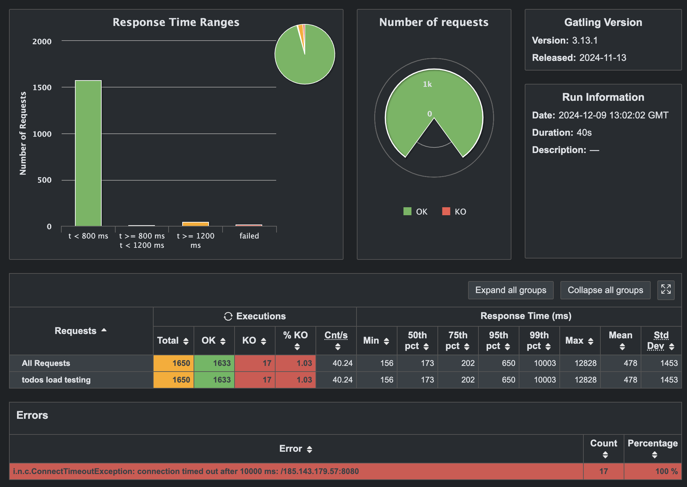

# BFHT Testing Project (Kotlin-based)

This project is a Kotlin-based testing framework designed to perform two types of tests:

- **API Tests**: Functional tests to verify REST API functionality.
- **Load Testing**: Performance tests using Gatling to evaluate the system under specified load conditions.

## Prerequisites

- **Java 17 or higher**: Ensure your system is running Java version 17 or newer.
    ```shell
    java -version
    ```
- **Gradle**: Installed on your system. Alternatively, use the Gradle Wrapper (`./gradlew`).

## Configuration

Before running the tests, you need to configure the project by following these steps:

1. Locate the `application.example.conf` file in the `resources` directory.
2. Copy the file to `application.conf`:
    ```shell
    cp src/main/resources/application.example.conf src/main/resources/application.conf
    ```
3. Update the following keys in `application.conf` to match your deployed environment:

- `service.proto`: Either http or https.
- `service.host`: The base URL of your REST API (e.g., `localhost` for local Docker).
- `service.port`: TCP port (e.g., `8080` for local Docker).
- `service.endpoints.ws`: The WebSocket endpoint (e.g., `/ws` for local Docker).
- `service.endpoints.todo`: The REST API endpoint (e.g., `/todos` for local Docker).
- `service.auth.username`: The username for authentication.
- `service.auth.password`: The password for authentication.

## Running Tests

### First, please run docker container with the required image

```shell
./gradlew restartDockerContainer
```

### API Tests

To run API tests, execute the following command:

  ```shell
  ./gradlew test --info
  ```

The results will be available in the `build/test-results/test` directory.
Open the `.xml` files or use a test reporting tool to view the results.

### Load Tests

The project uses Gatling for load testing.

#### !!! IMPORTANT !!!

It's recommended to restart the service before load testing begins:
    ```shell
    ./gradlew restartDockerContainer
    ```

To execute load tests:

1. Ensure you have properly configured `application.conf`
2. Run the following command:
    ```shell
    ./gradlew gatlingRun --all
    ```

### Viewing Results

After the Gatling load test completes, the results will be available in the `build/reports/gatling/<simulation-name>` directory.
Open the `index.html` file in your browser to view a detailed report of the test results.

### Results with my hardware (VPS)

VM provided for load testing was:

```text
VPS OS: Ubuntu 20.04 x64
1 CPU / 1024 Mb / 30 Gb / GEO: Georgia (Tbilisi)
```

### Median result:

```text
================================================================================
---- Global Information --------------------------------------------------------
> request count                                       1650 (OK=1633   KO=17    )
> min response time                                    156 (OK=156    KO=10002 )
> max response time                                  12828 (OK=12828  KO=10004 )
> mean response time                                   478 (OK=379    KO=10003 )
> std deviation                                       1453 (OK=1086   KO=1     )
> response time 50th percentile                        173 (OK=173    KO=10003 )
> response time 75th percentile                        202 (OK=200    KO=10004 )
> response time 95th percentile                        650 (OK=532    KO=10004 )
> response time 99th percentile                      10003 (OK=6957   KO=10004 )
> mean requests/sec                                  40.24 (OK=39.83  KO=0.41  )
---- Response Time Distribution ------------------------------------------------
> t < 800 ms                                          1579 (  95.7%)
> 800 ms <= t < 1200 ms                                  8 (  0.48%)
> t >= 1200 ms                                          46 (  2.79%)
> failed                                                17 (  1.03%)
---- Errors --------------------------------------------------------------------
> i.n.c.ConnectTimeoutException: connection timed out after 1000     17 (100,0%)
0 ms: /185.143.179.57:8080
================================================================================
```



You can find results [here](site/GatlingStats_09_12_2024-16-05-24.html)

## Example Scenarios

- **API Test Execution**:
    - Functional testing of API endpoints.
- **Load Testing**:
    - Evaluate the system under requests per second (RPS):
        - 5 RPS
        - 10 RPS
        - 50 RPS
        - 100 RPS

## Additional Notes

- Ensure your system has access to the required Docker containers if you are using a local Docker environment.
- If running the application on a different host, update the configuration in `application.conf` accordingly.

Happy testing! 🚀
